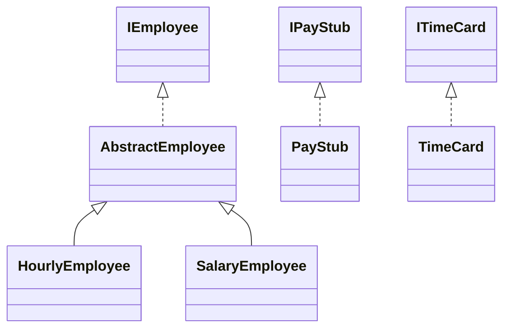

# Payroll Generator Design Document

This document is meant to provide a tool for you to demonstrate the design process. You need to work on this before you code, and after have a finished product. That way you can compare the changes, and changes in design are normal as you work through a project. It is contrary to popular belief, but we are not perfect our first attempt. We need to iterate on our designs to make them better. This document is a tool to help you do that.

If you are using mermaid markup to generate your class diagrams, you may edit this document in the sections below to insert your markup to generate each diagram. Otherwise, you may simply include the images for each diagram requested below in your zipped submission (be sure to name each diagram image clearly in this case!)

## (INITIAL DESIGN): Class Diagram

## (INITIAL DESIGN): Tests to Write - Brainstorm

### Write a test (in english) that you can picture for the class diagram you have created. This is the brainstorming stage in the TDD process. 

I am going to create a PayStub class which will be the main file to store the payroll results. I will also create a TimeCard class to store the hours worked for the employees and an employee class for the different hourly and salaried workers. Since hourly and salaried employees have almost identical fields that need to be filled in like ID, pay rate, YTF Earnings, taxes, pretax deductions, I will create a AbstractEmployee superclass. HourlyEmployee and SalaryEmployee will be subclasses of it.

Then payroll generator will parse the CSV file, use the builder to create the obejcts and match time cards to the employee ID. It should finally run payroll and create the output file.
You should feel free to number your brainstorm. 

Hrainstorming Tests:
1. Employee properly returns their name from getName()
2. Employee properly returns their ID from getID()
3. Employee properly returns their pay rate from getPayRate()
4. TimeCard stores and returns apprpriate employee ID
5. TimeCard Stores and returns the correct amount of hours worked.
6. Hourly employee is paid regular pay for <=40 hrs of work.
7. Hourly employee paid overtime pay for >=40 hrs of work

## (FINAL DESIGN): Class Diagram

Go through your completed code, and update your class diagram to reflect the final design. We want both the diagram for your initial and final design, so you may include another image or include the finalized mermaid markup below. It is normal that the two diagrams don't match! Rarely (though possible) is your initial design perfect. 

> [!WARNING]
> If you resubmit your assignment for manual grading, this is a section that often needs updating. You should double check with every resubmit to make sure it is up to date.

## (FINAL DESIGN): Reflection/Retrospective

> [!IMPORTANT]
> The value of reflective writing has been highly researched and documented within computer science, from learning new information to showing higher salaries in the workplace. For this next part, we encourage you to take time, and truly focus on your retrospective.

Take time to reflect on how your design has changed. Write in *prose* (i.e. do not bullet point your answers - it matters in how our brain processes the information). Make sure to include what were some major changes, and why you made them. What did you learn from this process? What would you do differently next time? What was the most challenging part of this process? For most students, it will be a paragraph or two. 
